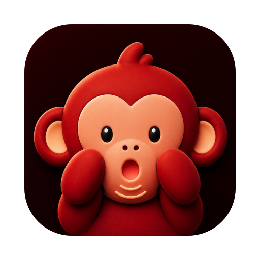
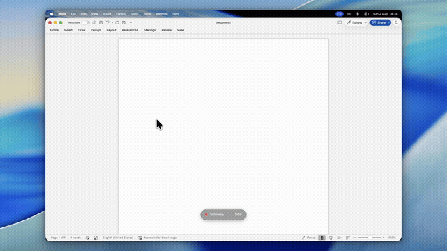

<p align="center">
  
</p>

<h1 align="center">Speak</h1>

<p align="center"><b>Talk instead of typing. Anywhere on your Mac.</b></p>

<p align="center">
  <a href="https://github.com/mugoosse/speak/actions/workflows/build.yml"></a>
  <a href="https://github.com/mugoosse/speak/releases/latest"></a>
  
  <a href="LICENSE"></a>
</p>

<p align="center">
  
</p>

Press a shortcut, say what you mean, press it again. Your words appear in
whatever app you are already in: an email, Slack, a search bar, a code comment.

Free, no account, and your voice never leaves your Mac. **There is no account
because there is no server.** That is the whole app.

## Download

### **[Download Speak for Mac](https://github.com/mugoosse/speak/releases/latest/download/Speak.dmg)**

Open the downloaded file and drag **Speak** to Applications. It is signed and
notarized by Apple, so it opens normally, with no "unidentified developer"
warning to click through.

<details>
<summary>Prefer Homebrew?</summary>

```sh
brew install --cask mugoosse/tap/speak
```

Homebrew installs update with `brew upgrade --cask speak` rather than through
the in-app updater. The two do not fight.

</details>

### What you need

- **A Mac with Apple silicon**, meaning an M1 or newer, so any Mac sold since
  late 2020. There is no Intel version.
- **macOS 14 or later.** The Apple Intelligence engine additionally needs
  macOS 26.
- **About 5 GB free**, for the speech model Speak downloads once on first run.
  You can skip that entirely by choosing Apple Intelligence instead.

### First run

A setup window walks through it. Speak asks for two permissions:

1. **Microphone**, so it can hear you.
2. **Accessibility**, so your shortcut works while you are in another app.

Then it downloads the speech model. That takes a few minutes on a normal
connection, and it is the only time Speak uses the internet. Once the model is
on disk you can turn the wifi off and it still works.

If the shortcut does nothing afterwards, see
[Troubleshooting](#troubleshooting). There is one common macOS quirk with a
one-line fix.

## How fast

About **35 ms** to turn a 6-second sentence into text, measured warm on an
M4 Max. In practice the words are on screen before you have finished letting
go of the key.

Most people speak at around 150 words a minute and type at around 40.

## Why nothing leaves your Mac

Speak downloads a speech model once and then runs it on your own hardware,
using Apple's MLX framework. Transcription never touches the network, so there
is nothing to log in to, nothing to subscribe to, and no server that could hold
your recordings even in principle.

The trade is honest and worth stating: when a local model gets a word wrong,
it is wrong. There is no cloud fallback to catch it. See
[Limitations](#limitations) for the rest of what Speak deliberately will not do.

---

# Manual

Everything below is reference. You do not need any of it to use Speak.

[Use](#use) ·
[Engines](#engines) ·
[Shortcut](#shortcut) ·
[Microphone](#microphone) ·
[History](#history) ·
[Updating](#updating) ·
[Troubleshooting](#troubleshooting) ·
[Uninstalling](#uninstalling) ·
[Config](#config) ·
[Disk use](#disk-use) ·
[Building from source](#building-from-source) ·
[Design](#design) ·
[Limitations](#limitations) ·
[Contributing](#contributing)

## Use

Press **fn + ⇧ left** (the default) to start, speak, press again to stop. The
transcript is pasted into whatever is focused and stays on the clipboard, so
⌘V works too. Turn off **Paste automatically** in Settings to only copy. The
menu bar icon tracks state:

| Icon | Meaning |
|---|---|
| the I-beam | ready |
| the I-beam, crossed out | loading the model, or setup unfinished |
| the I-beam, knocked out of a filled square | recording |
| hourglass | transcribing |
| download arrow | fetching the model, with elapsed time |
| warning triangle | see the menu for what went wrong |

The mark is Speak's own I-beam, the same one on the app icon, so it is possible
to tell which app it belongs to. Clicking it names the app at the top of the
menu.

## Engines

Choose in **Settings → Model**, or during setup.

| Engine | Trade-off |
|---|---|
| **Parakeet v2** (default) | English only · most accurate · 2.4 GB download |
| **Parakeet v3** | 25 languages · may misdetect short clips · 2.4 GB download |
| **Apple Intelligence** | Built in · no download · ready immediately · less accurate |

### Where the Parakeet model comes from

[Parakeet TDT](https://huggingface.co/nvidia/parakeet-tdt-0.6b-v2) is NVIDIA's
speech recognition model, released under CC-BY-4.0. Speak uses the MLX
conversions published by the [mlx-community](https://huggingface.co/mlx-community)
project, which repackage the NeMo weights to run on Apple Silicon:

| Engine | Repository |
|---|---|
| Parakeet v2 | [`mlx-community/parakeet-tdt-0.6b-v2`](https://huggingface.co/mlx-community/parakeet-tdt-0.6b-v2) |
| Parakeet v3 | [`mlx-community/parakeet-tdt-0.6b-v3`](https://huggingface.co/mlx-community/parakeet-tdt-0.6b-v3) |

They are fetched from Hugging Face the first time you select one, by
[mlx-audio-swift](https://github.com/Blaizzy/mlx-audio-swift) via
[swift-huggingface](https://github.com/huggingface/swift-huggingface). No
account or token is needed; both repositories are public.

**That download is the only time Speak touches the network.** Transcription
never does, so once the model is on disk the app works offline. Apple
Intelligence never downloads anything through Speak, since its assets are
managed by macOS.

Settings > Model links to the exact repository in use.

### Why Parakeet v2 by default

**Not Whisper.** Benchmarked against Parakeet on hard passages,
`whisper-large-v3-turbo` hallucinated multilingual text on trailing silence, a
well-documented failure mode. For dictation that is disqualifying: it invents
words you never said and drops them into your clipboard. Dropped words you
notice; invented ones you do not.

**Not Parakeet v3.** v3 is multilingual and, on a short utterance with little
context, decodes English speech as Cyrillic. It cannot be constrained here:
mlx-audio's `language` parameter is copied into the output struct and never
reaches the decoder. (TypeWhisper does restrict v3 by language, but it runs
Parakeet through [FluidAudio](https://github.com/FluidInference/FluidAudio),
whose ASR manager takes a real `language:` argument.)

v2 is the English-only predecessor: same speed, same architecture, and
structurally unable to emit Cyrillic. A model that cannot produce Russian beats
one that is merely discouraged from it.

### Language

The **Language** picker appears only for Apple Intelligence, because that is the
only engine where it does anything. `SpeechTranscriber` takes a locale that
genuinely constrains recognition; Parakeet has no equivalent control, so
offering one there would be a setting that silently does nothing.

Automatic prefers a locale already installed on your Mac. Options marked
*(downloads)* fetch a small language pack on first use.

## Shortcut

**Settings → General → Change…**, then hold your combination and release.

Up to three modifiers (fn, shift, control, option, command), optionally followed
by one ordinary key. Left and right modifiers count separately, so `⌃ left` and
`⌃ right` are different shortcuts.

- `fn + ⇧ left`: pure modifier chord
- `fn + ⇧ left + P`: with a character key, which is **swallowed** so it does not
  also type a P into whatever is focused

A single modifier is allowed but warned about: it fires every time you press
that key, including mid-sentence.

## Microphone

**Settings → General → Microphone.** "System default" follows Sound settings.
Pick a specific device to pin it regardless.

Devices are saved by UID, not by numeric ID: `AudioDeviceID` is assigned at
connect time, so unplugging a USB mic and reconnecting changes the number. If a
pinned device is disconnected, Speak records from the system default and says so,
then re-binds when the device returns.

## History

Every dictation is appended to
`~/Library/Application Support/speak/history.jsonl`:

```json
{"at":"2026-07-29T13:59:32Z","duration_sec":1.3,"words":5,"text":"…"}
```

**Settings → History** lists them all: double-click a row to copy, or reveal the
file. The menu bar shows the last five.

JSONL rather than a database so it stays greppable and outlives the app:

```sh
jq -r .text ~/Library/Application\ Support/speak/history.jsonl
```

Delete the file to clear it. Nothing is sent anywhere.

## Updating

Speak checks for updates every two days and offers them through
[Sparkle](https://sparkle-project.org). **Check for Updates…** in the menu bar
does it on demand, and **Settings → About** has the same button along with the
answer the last check gave, the time it ran, and a switch for the scheduled
ones. Each update is verified twice before it installs: an EdDSA signature over
the archive, checked against a public key compiled into the app, and macOS code
signing. An update signed by anything else is refused.

Homebrew installs update the usual way instead, and the two do not fight:

```sh
brew upgrade --cask speak
```

Speak starts at login by default on a new installation. Change this at any time
under **Settings → General → Start Speak at login**. If macOS needs approval,
Speak links directly to System Settings → General → Login Items.

If you build from source, `./install.sh` quits the old copy, replaces it and
relaunches. Permissions survive because `make_app.sh` signs with a stable
identity.

## Troubleshooting

### Speak is listed in Accessibility but the shortcut does nothing

Remove it with the minus button and add it again. macOS keeps a stale entry
after an app is replaced, and that stale entry is the single most common reason
a working install stops responding.

### The fn key does nothing, or opens the emoji picker

macOS may be reserving fn for the emoji picker. Set System Settings → Keyboard
→ "Press 🌐 key to" → **Do Nothing**, or:

```sh
defaults write com.apple.HIToolbox AppleFnUsageType -int 0
```

Log out and back in for it to take effect.

### Working out whether it is the model or the shortcut

```sh
/Applications/Speak.app/Contents/MacOS/Speak --transcribe some.wav
```

Transcript to stdout, timings to stderr, no permissions needed. If that works,
the model is fine and the problem is the shortcut. `SPEAK_DEBUG=1` traces every
modifier change to stderr.

## Uninstalling

Quit Speak from the menu bar, then drag **Speak** from Applications to the
Trash. Or:

```sh
brew uninstall --cask speak
```

That is genuinely all most people need. It leaves three small things behind.

**Remove the permission entries.** System Settings → Privacy & Security →
**Accessibility**, select Speak, click **−**. Same under **Microphone**.

This is the one worth doing. macOS keeps the entry after the app is gone, and a
stale entry is the single most common reason a reinstalled Speak looks
installed but the shortcut does nothing. Removing it now saves confusion later.

**Delete the settings and history**, if you would rather not leave transcripts
on disk:

```sh
rm -rf ~/Library/Application\ Support/speak        # transcript history
rm -f  ~/Library/Preferences/com.mgo.speak.plist   # settings and shortcut
rm -rf ~/Library/Caches/com.mgo.speak              # update cache
```

`brew uninstall --zap --cask speak` does the same three in one step.

**Delete the model**, if you want the 4.6 GB back. It lives in the shared
Hugging Face cache, so delete the two Parakeet directories rather than the
cache itself, which probably holds other things:

```sh
rm -rf ~/.cache/huggingface/hub/models--mlx-community--parakeet-tdt-0.6b-v*
rm -rf ~/.cache/huggingface/hub/mlx-audio/mlx-community_parakeet-tdt-0.6b-v*
```

Both paths are the same model stored twice; see [Disk use](#disk-use). Apple
Intelligence leaves nothing behind, as its assets belong to macOS.

Finally, remove Speak from Login Items if it still appears there: System
Settings → General → Login Items.

## Config

Environment variables override the UI, for one-off runs:

| Variable | Default | Meaning |
|---|---|---|
| `SPEAK_MODEL` | unset | force a model repo; disables the Model picker |
| `SPEAK_AUTOPASTE` | unset | `1` forces the ⌘V press on, even if Settings has it off |
| `SPEAK_DEBUG` | unset | `1` traces every modifier change to stderr |

## Disk use

Parakeet is stored **twice**, about 4.6 GB total: once in the Hugging Face blob
cache (`~/.cache/huggingface/hub/models--…`) and once in mlx-audio's own
directory (`~/.cache/huggingface/hub/mlx-audio/…`). That duplication is
mlx-audio's design, not something Speak controls.

Apple Intelligence adds nothing of its own; its assets are system-managed and
usually already present because system dictation uses them.

## Building from source

Only needed to develop Speak; the releases above are prebuilt.

```sh
./build.sh      # xcodebuild wrapper
./make_app.sh   # wrap the binary in a signed .app
./install.sh    # both, then install to /Applications and relaunch
swift make_icon.swift            # regenerate Assets/icon.png and Assets/Speak.icns
swift make_social_preview.swift  # regenerate Assets/social-preview.png
```

`swift build` alone is **not** enough. It links successfully and then dies at
runtime with `Failed to load the default metallib`, because SwiftPM never
compiles MLX's Metal kernels. Two further wrinkles, both handled by `build.sh`:

- Xcode 26 ships the Metal compiler as a separate downloadable component.
- mlx-swift ships a `CudaBuild` plugin Xcode refuses to run unattended, hence
  `-skipPackagePluginValidation`. It is a no-op on Apple Silicon.

### Signing matters more than it looks

Ad-hoc signing (`codesign --sign -`) produces a designated requirement of
`cdhash H"…"`, which is the hash of *that exact build*. TCC pins the
Accessibility grant to it, so every rebuild silently invalidates the permission:
the toggle still looks on in System Settings, but the new binary is a different
app as far as macOS is concerned, and the shortcut quietly stops working.

`make_app.sh` therefore signs with a real certificate when one is available,
giving a stable requirement:

```
identifier "com.mgo.speak" and anchor apple generic and
certificate leaf[subject.CN] = "Apple Development: …"
```

Any certificate works, including the free Apple Development one Xcode installs
when you add an Apple ID. Without one it falls back to ad-hoc and prints a
warning explaining the consequence.

## Design

Single process, no IPC. The engine loads once at launch into an actor and stays
resident, which is what makes dictation feel instant: load is a one-off cost,
transcription is tens of milliseconds. Captured samples go straight from
`AVAudioEngine` into an `MLXArray` with no intermediate WAV file.

Audio is captured at the input device's preferred rate and converted to 16 kHz
mono Float32, which is what Parakeet expects. Clips under one second are padded
with silence, because Parakeet degrades badly on very short inputs and a
one-word dictation is easily that short.

### The shortcut

A modifier chord cannot use `RegisterEventHotKey` (it requires a non-modifier
key) and never arrives as a `keyDown`. Both halves are reconstructed from a
`CGEventTap`, which has four traps worth knowing:

1. **`NSEvent` global monitors never see fn on Apple Silicon.** The Globe key is
   consumed by the system first, so a monitor reports the shift half of the
   chord and never the fn half. The tap sits lower and reports fn as
   `maskSecondaryFn`.
2. **`.function` is also set by arrow and F-keys**, so testing that flag alone
   misfires constantly.
3. **`NSEvent.shift` cannot tell left from right.** That needs the
   device-dependent bit `0x02`.
4. **Tap callbacks must be dispatched in order.** Using one `Task` per event
   loses ordering, and an all-released event can overtake the key-downs and
   truncate a chord being recorded.

`SPEAK_DEBUG=1` traces what your keyboard actually reports, which is how the fn
issue above was diagnosed.

This is also why Accessibility is not an optional permission: a modifier chord
never arrives as a `keyDown`, so it has to be read from a low-level event tap,
which macOS only allows for trusted apps.

### Download progress is elapsed time, not a percentage

`URLSession.download` streams the weights into a system temp path and only moves
the finished file into the cache, so nothing observable grows while the large
file is in flight. A directory-derived percentage sits at 0% for the whole
download and then jumps to 100%, which reads as hung. Elapsed time is less
informative but true.

## Limitations

Stated up front rather than discovered later. Most of these are decisions, not
gaps, but they are still things Speak will not do for you.

**Apple Silicon only, macOS 14 or later.** MLX is Metal-based and has no Intel
path. The Apple Intelligence engine additionally needs macOS 26.

**No language picker for Parakeet.** mlx-audio accepts a `language` parameter,
copies it into its output struct, and never passes it to the decoder. A picker
would be a control that silently does nothing, so there isn't one. The default
is the English-only v2 for the same reason: multilingual v3 decodes short
English clips as Cyrillic often enough to be a problem.

**Download progress is elapsed time, not a percentage.** Not a stylistic
choice; nothing observable grows during the transfer. Explained
[above](#download-progress-is-elapsed-time-not-a-percentage).

**No streaming partial results.** You get the transcript when you stop talking,
not as you speak. Parakeet transcribes a complete utterance.

**No custom vocabulary or dictionary.** Names, jargon and acronyms come out
however the model heard them.

**No cloud fallback, ever.** When the local model is wrong, it is wrong. That
is the trade for audio never leaving the machine.

**Text is inserted with a synthetic ⌘V, not typed at the cursor.** Some apps
ignore a synthetic keystroke, and the paste lands wherever focus happens to be.
The transcript is always on the clipboard as well, and **Paste automatically**
in Settings turns the keystroke off.

**Transcripts are stored in plaintext.** The history file is unencrypted JSONL
in your home directory. Clear it in Settings if you dictate anything sensitive.

**Parakeet takes about 4.6 GB on disk**, not 2.4 GB, because mlx-audio keeps
its own copy alongside the Hugging Face cache. See [Disk use](#disk-use).

## Contributing

Pull requests welcome. There is no test target, so verification is manual and
has to be stated in the PR: `./build.sh`, then `--transcribe` on a real file,
then one dictation through the shortcut.

`CLAUDE.md` documents the traps in this codebase, all of which were found the
hard way. Read the one nearest your change before you make it.

- [RELEASING.md](RELEASING.md), how a release is cut
- [SECURITY.md](SECURITY.md), what Speak can reach and how to report a problem

## Credits

Made by [Maxime Goossens](https://maxgoespublic.com/).

Speech models are [Parakeet TDT](https://huggingface.co/nvidia/parakeet-tdt-0.6b-v2)
by NVIDIA (CC-BY-4.0), converted for Apple Silicon by
[mlx-community](https://huggingface.co/mlx-community) and run through
[mlx-audio-swift](https://github.com/Blaizzy/mlx-audio-swift) and
[mlx-swift](https://github.com/ml-explore/mlx-swift). Apple Intelligence
transcription uses the Speech framework built into macOS.

## License

Copyright (C) 2026 Maxime Goossens.

Speak is free software under the [GNU Affero General Public License v3.0](LICENSE).
You may use, study, modify and redistribute it, and any distributed derivative
must also be AGPL 3.0 and ship its source.
